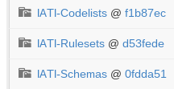
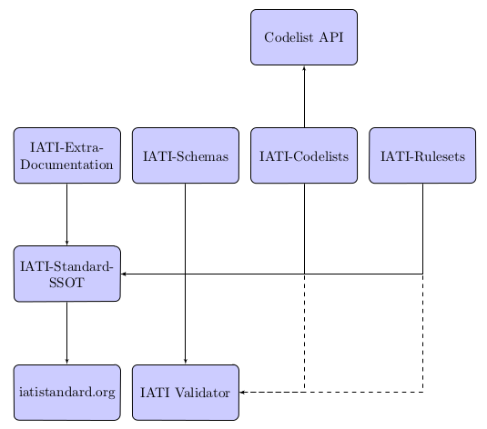

A Single Source of Truth for the IATI Standard
^^^^^^^^^^^^^^^^^^^^^^^^^^^^^^^^^^^^^^^^^^^^^^

This is a work in progress, and any suggested changes and improvements
are welcome.

Known tasks/issues are listed with the prefix TODO:

.. contents::

Introduction
============

Motivation
----------

By having a Single Source of Truth (SSOT) for the IATI standard, we create one
set (or sets) of documents that define the standard at any point in
time.

This is a 'backend' system. Most people will not know, or need to know
how it works, or of its existence. Most people will access the
information held in the SSOT via other systems (websites, documents,
applications, etc)

Those people that want to know, or are interested in it, may gain
further knowledge of how it works and exploit that for their own use.
(e.g. developers may go directly to the SSOT to fetch data for their
applications)

We (IATI) should build our public facing services from the SSOT (eating
our own dog food). This means we can tell a consistent story across
platforms, and it allows us to know that it is working.

The SSOT will alter and change overtime. It is important therefore that
we are able to track changes over time, and therefore see 'snapshots' of
the IATI Standard. These will normally be linked with versions of the
IATI Standard, but not always. (see `Changes After Release`_).

 

Bundling up the standard
------------------------

To create or use data published to a version of the IATI Standard, you
need to know all about the SSOT that exists/existed for that version.
For a single source of truth to work with the IATI Standard you will
need to maintain a collection of documentation, guidance, XML schema,
codelists, and enforcement rules that define the standard at any one
time.

The least complicated way to achieve this is to 'bundle' versions of the
standard, so that everything for one version can be found in one place.

About GitHub
------------------

At it’s core, `GitHub <https://github.com/>`__ is a hosted service for
the git version control software. Everything on github is stored as flat
files, but these can be in whatever format. Files are stored in
‘repositories’. Versioning on GitHub is at on a per repository basis
(not per file). Different types of versions are tracked via commits,
branches, and tags.

Pros and Cons GitHub to store our Single Source of Truth
--------------------------------------------------------

Pros:

-  Can store all the data in one place
-  Very structured versioning information
-  Makes it easy to pull a copy of the entire SSOT (all versions etc.),
   provided you have git knowledge
-  Git (and github) allow distributed teams to collaborate easily
-  Git workflows encourage independent changes that are then reviewed
   before publication.
-  Documentation is not in 'Word'.
-  Changes can be viewed publicly as we are working on them - this may
   allow us to reduce the time between upgrades.
-  It allows us to introduce non-functional changes between release
   cycles

Cons:

-  ‘Single source’ is split across multiple git repositories (however,
   we can use submodules to link these)
-  GitHub, while widely known and used in developer circles is not
   necessarily something non-techies would be comfortable with. As this
   is a backend system this is not necessarily a large con.
-  Editing documentation for example would have to be done on the web
   (on GitHub, via it's interface) or editors would need to learn how to
   checkout documents locally, work on them and submit them for review
-  Documentation is not in 'Word'.
-  A simple markup language would be used for creating human readable
   documents
-  It is easy perhaps too easy make changes without thinking them
   through
-  Reliance on Github (the “what if” they go down/sell out etc)

GitHub Architecture
===================

Submodules
----------

|image0|

Git submodules are a way of including one git repository with another.
On github they are indicated by the ‘folder within a folder’ icon.
Submodules track a specific commit on the remote repository. On github,
clicking on the name takes you to the general repository page, whereas
clicking on the commit hash (f1b87ec etc.) takes you to the exact
commit.

We use git submodules to include all the other SSOT repositories into a
parent IATI-Standard-SSOT repository. Since submodules track specific
commits, checking out an old version branch of the IATI-Standard-SSOT
repository will also pull in the old versions of the other repositories.

Repositories
------------

The IATI Standard is, in practice, a collection of schemas, rulesets,
codelists and explanatory text/extra documentation. These are all
brought together as submodules of the IATI-Standard-SSOT repository, as
described above.

IATI-Standard-SSOT
~~~~~~~~~~~~~~~~~~

`https://github.com/IATI/IATI-Standard-SSOT <https://github.com/IATI/IATI-Standard-SSOT>`__ has
four submodules:

-  `https://github.com/IATI/IATI-Extra-Documentation <https://github.com/IATI/IATI-Extra-Documentation>`__
-  `https://github.com/IATI/IATI-Schemas <https://github.com/IATI/IATI-Schemas>`__
-  `https://github.com/IATI/IATI-Codelists <https://github.com/IATI/IATI-Codelists>`__
-  `https://github.com/IATI/IATI-Rulesets <https://github.com/IATI/IATI-Rulesets>`__

IATI-Extra-Documentation
~~~~~~~~~~~~~~~~~~~~~~~~

This holds any extra text documentation (ie. what would have been on the
wiki previously). This has been scraped (a one off process) from the
wiki and converted to reStructuredText format, in order to work with the
new `documentation generation`_ process.

Although reStructuredText is different from wiki markup in many ways,
the main principle is the same - it is very human readable and writeable
markup, that should be quite straightforward for non-programmers to
write.

The documentation is structured such that each file is named after the
xml element it describes, with subfolders for nested elements. This
means that no extra mapping is needed to combine this documentation with
the information from the schema.

IATI-Schemas
~~~~~~~~~~~~

The schemas repository is unchanged from what it is previously.

IATI-Codelists
~~~~~~~~~~~~~~

The codelists in
`https://github.com/IATI/IATI-Codelists <https://github.com/IATI/IATI-Codelists>`__ have
been donwloaded from the data.aidinfolabs.org site. The structure of the
XML files was then updated to be more consistent, and conform to a
`codelist
schema <https://github.com/IATI/IATI-Codelists/blob/master/codelist.xsd>`__.
This new structure is not compatible with the old one - to provide
backwards compatibility with tools that expect the old codelist
structure, we could have our ‘API’ do this conversion, or just create a
static mirror of the old codelists and deprecate it.

Since codelists are now versioned as part of the Single Source of Truth,
the @version and @date-last-modified attributes are now redundant, so
will be removed.

    TODO: Discuss changes to codelists

A machine readable `mapping
file <https://github.com/IATI/IATI-Codelists/blob/master/mapping.xml>`__ describes
what elements and attributes use which codelists. (This does not
currently exist). It was not practical to do this using file naming
conventions since each a codelist can be used in several places.

IATI-Rulesets
~~~~~~~~~~~~~

The rulesets
`https://github.com/IATI/IATI-Rulesets/blob/master/rulesets.json <https://github.com/IATI/IATI-Rulesets/blob/master/rulesets.json>`__ have
been created afresh, in a new easy to parse JSON format. This is very
much a work in progress, and my working notes can be found at
`http://iati.titanpad.com/5 <http://iati.titanpad.com/5>`__

`Python <https://github.com/IATI/IATI-Rulesets/blob/master/testrules.py>`__ and
`PHP <https://github.com/IATI/IATI-Rulesets/blob/master/testrules.php>`__ libraries
for testing against these rulesets - with the idea that it should be
easy to write one for any other programming language.

This is a drastic change from what we had previously, but I believe it
is appropriate since a) the previous machine rulesets weren’t official,
and b) a json file containing xpath like this can be used in many
programming languages (two examples above), unlike the constraints of
the current xquery.

The current rulesets in the draft SSOT have been created on the previous
compliance tests. However, these are not necessarily what we want going
forward, and should be split out into those rules that are definitely
part of the standard (a start date is by definition before an end date)
and those that should be split out into optional files.

    TODO: Decide what rules we should have.

Generated Repositories
----------------------

Some of the SSOT repositories, can be used to generate extra text/data,
which might also be useful to track in git repositories:

-  `https://github.com/IATI/IATI-Codelists-Output <https://github.com/IATI/IATI-Codelists-Output>`__

-  XML codelists converted into json and csv, and also an `automatically
   generated xml list of
   codelists <https://raw.github.com/IATI/IATI-Codelists-Output/master/codelists.xml>`__
-  generated from
   `https://github.com/IATI/IATI-Codelists <https://github.com/IATI/IATI-Codelists>`__ (see
   `Machine Consumption`_)
-  This would form the basis of/be the new Codelist API

-  We could also have a github repository for the generated
   documentation

These could be generated automatically using github webhooks. They
should be tagged and branched in the same way as the source
repositories.

The advantages of using github repositories for this are:

-  Allow people to download machine readable data in their preferred
   format e.g. get all the codelists in json format
-  Allows people who are not familiar with our source formats (xml,
   reStructuredText) to easily view what the changes in the output
   (json, html) are

-  Similarly allows us to more easily keep track of changes to
   documentation pages, without having to check all relevant source
   repositories

-  Allows us to easily keep track of the generated text/data for
   different versions by using the same branches and tags as the source
   repositories

(There may be other generated data repositories we have, unrelated to
the SSOT, such as
`https://github.com/IATI/IATI-Data-Snapshot <https://github.com/IATI/IATI-Data-Snapshot>`__)

Branches
--------

Main branches:

-  master - the main development branch, where development for the next
   version of the standard takes place
-  version\_1.03 etc. - branch for each version,

These branches should be consistent across all the SSOT.

Currently only the master branch exists, as it’s not clear what version
of the standard we will target initially with the SSOT (1.03 or should
it wait to 1.04). Also, no previous versions of the standard are not yet
in the SSOT.

There are also feature branches that are specific to individual
repositories. These are for any changes that need reviewing/testing
before they are merged into one of the main branches.

    TODO: determine when feature branches should be used and when/if
    committing directly to the main branches is appropriate.

Tags
----

Tags starting with a v refer to a released version of the IATI Standard
(e.g. v1.03 or v1.03.1). This tagging scheme is already `used for the
schemas <https://github.com/IATI/IATI-Schemas/releases>`__. Tags should
be consistent across all of the repositories, and the submodules should
point at commits with the same tag. We would need to manage this as part
of our internal workflow/policy.

There is currently no other planned uses for tags, although we could
easily do so (e.g. to tag a snapshot on a particular date).

GitHub Issues
-------------

GitHub Issues are used for people to suggest changes to the IATI
Standard.

    TODO: Think about how this fits in with our current use of the
    knowledge base

Issues are categorised using Milestones and Labels - only people with
push access can add these. This means there is a task for one of u to
add the appropriate labels and milestones for each issue that is added.
There are advantages to this, since we know that every label and
milestone has been determined by us.

It is also possible for us to edit the title of issues, to ensure that
they are usefully descriptive for us.

Assignment
~~~~~~~~~~

Issues can be assigned to a the person responsible for carrying out the
next action on them. A list of all issues assigned to your logged in
user can be seen at
`https://github.com/organizations/IATI/dashboard/issues/assigned <https://github.com/organizations/IATI/dashboard/issues/assigned>`__

Milestones
~~~~~~~~~~

Issues can be grouped into Milestones which will be used to build the
roadmap for the next release of the IATI Standard. Each github
repository will have a milestone for each new version of the standard,
consistently named. Only issues that we have decided to include in a
given version of the standard should be tagged with that milestone.

Labels
~~~~~~

Default github labels:

-  wontfix - issues that have been closed, because we have rejected the
   suggested change
-  bug -  Small changes that we want to fix asap, outside of the normal
   release process (such as typos)
-  enhancement - for improvements to the standard, rather than things
   that are currently ‘broken’
-  duplicate - for duplicate issues - only one of the issues should be
   tagged with this, and closed

Custom labels - these should be added

-  Activity XML - for issues relating to the activity xml
-  Organisation XML - for issues relating to the organisation xml

    TODO: Decide is these custom labels make sense, then add them to all SSOT repositories.

Issues in correct repository
~~~~~~~~~~~~~~~~~~~~~~~~~~~~

Issues should be reported to the `repository <Repositories_>`_ that
is most relevant - e.g. codelists issues in the IATI-Codelists
repository. If an issue is not in the most relevant place, we should
move it.

GitHub does not allow for issues to moved automatically, but we will
manually move any issues that have been reported in the the wrong
repository. This would involving labelling as duplicate and closing the
old issue, and adding a link to the newly open issue.

Github Team
-----------

A Github Team will be set up for the Single Source of Truth, with push
access to each of the repositories. Members of this team will also be
able to have issues assigned to them.

Changes After Release
---------------------

There is regular pressure on the 'standard' to alter it between upgrade
releases. Sometimes this is to do with simple documentation errors,
codelist inaccuracies, or even a bug in the schema.

One way that we try to deal with this is to have regular release cycles,
that way anything that 'can't be changed' need only wait a few (6?)
months to be fixed.

However, sometimes this means very minor changes get held up for no good
reason. The GitHub approach outlined here may give us opportunities.

A functional change is one which changes whether a given IATI XML file
is considered to validate against the standard. This includes validation
against the schema, conformance to rulesets and conformance to
functional codelists.

    TODO: Determine which codelists are functional codelists. (This is
    likely to take place as part of a separate piece of work around
    codelists.

After a minor (decimal) release, (e.g. 1.03) is tagged, there should be
no further functional changes to that versions branch (e.g.
version\_1.03). However, we may want to make non-functional changes,
such as correcting documentation and adding to non-functional codelists.

We could make those changes to the git branches and the website, and not
make a new release, and tell people to check the github to see what has
changed since release. Or, we could have patch releases for such changes
(e.g. 1.03.1). Alternatively, we could do a mixture of both, depending
on how small the change is, and whether we want to announce it to
everyone (e.g. correcting a typo vs. drastically rewording
documentation).

    TODO: Decide approach on this.

If used, patch releases would always be non-functional, so SHOULD NOT be
listed in the @version attribute, in order to reduce the complexity for
data complexity. We should have explicit guidance about what values the
@version attribute should contain.

Tracking Changes a guide for users/followers

Updating the SSOT
=================

Since the SSOT is hosted on github, it can be updated by developers
using git to pull/push from their local machine, or through github’s web
interface for editing.

Editing through the web interface
---------------------------------

Anyone on the IATI Tech team who wants to edit the SSOT should be
granted push access to the `Github Team`_, on the
understanding that they do not edit directly edit on any of the main
branches but create a `feature branch <Branches_>`_ for the
change they are suggesting. A pull request can then be submitted to the
relevant branch.

Suggested improvements through GitHub issue
-------------------------------------------

Additionally, anyone can suggest changes by creating a GitHub
issue in the relevant repository. See the `GitHub
Issues`_ section for more.

Using the SSOT
==============

|image1|

Documentation generation
------------------------

The documentation on
`http://iatistandard.org/ <http://iatistandard.org/>`__ will be
generated from the Single Source of Truth.

Text generated from the machine readable sources is combined with the
extra documentation, which is then fed into Sphinx documentation tool.
The scripts for doing this are in the IATI-Standard-SSOT repository, and
the full technical instructions are in the
`README <https://github.com/IATI/IATI-Standard-SSOT/blob/master/README.rst#building-the-documentation>`__ there.

This automated process for documentation generation makes it easy to
generate the documentation in other formats, such as a single pages html
file, or a pdf.

Machine Consumption
-------------------

Moving forward, the preferred method of fetching machine readable
information from the Single Source of truth will be via
github. The advantage of this is that, via
branching, there will be a consistent way for people to query different
versions of the standard, without any extra effort on our side. (The
downside is that github doesn’t look as authoritative as hosting it on
iatistandard.org ourselves - one compromised would be redirects from
`http://iatistandard.org/api/something <http://iatistandard.org/api/something>`__ to
the appropiate github page)

    TODO: Discuss.

In some cases, we will make the data easier to consume automatically by
preprocessing it, and pushing it to ‘Generated Data’ repositories. See
the `Generated Repositories`_ section for more.

Case Studies
------------

The Validator
~~~~~~~~~~~~~

Currently the validator only validates against the schema. Eventually,
the validator should be able to check files against all machine readable
parts of the SSOT - currently this is codelists and rulesets in addition
to the schema.

Plan
====

Much of the technical backend of the Single Source of Truth is set up
now. The big next step is to work on the human processes of managing the
git repositories properly etc.

We can do this in tandem with our work on 1.04 - dev.iatistandard.org
will be set up to build from the Single Source of Truth, and this will
become the new website when 1.04 is released.

Current versions of the standard
--------------------------------

Due to some of the changes proposed, it is cumbersome to move old
versions of the Standard into the Single Source of Truth. I propose
continuing to maintain these separately, using our current archiving
process with the wordpress.

